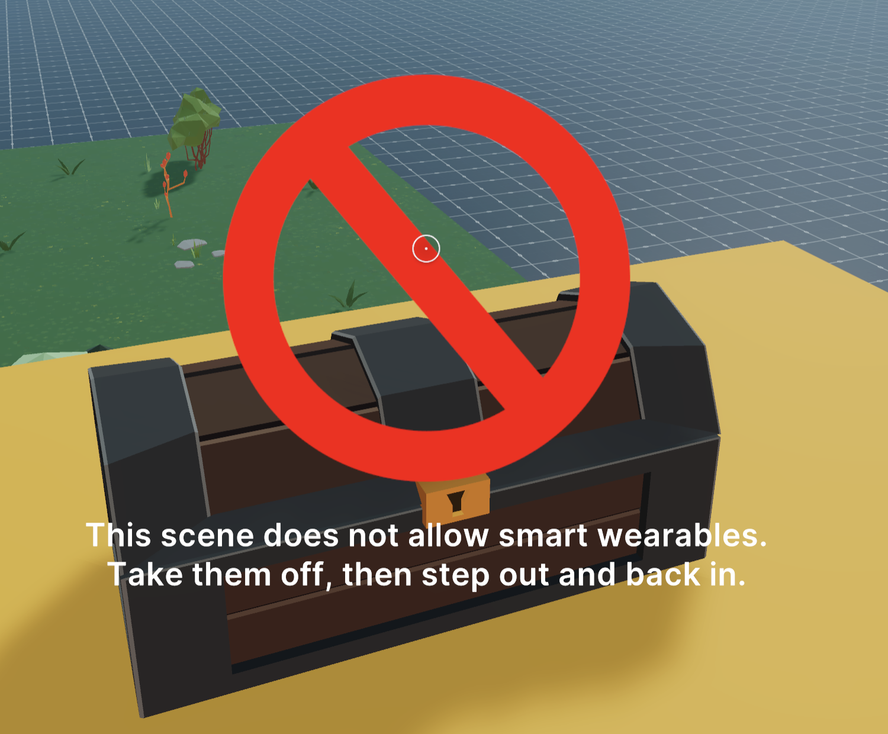

# Block Smart Wearables

Forbid players from claiming a prize if having any smart wearables or portable experiences on.

The scene includes a series of slightly challenging jumps up to the top, and a treasure to claim at the end. This scene checks if a player is wearing a smart wearable or has a portable experience active, such as a jetpack or any other item that might allow the player to have an unfair advantage over others. It also makes sure the player hasn't had a portable experience on at any given time since having stepped into the scene's parcels.

To enjoy the scene in full, the player must disable all portable experiences (either by deactivating them or by taking off their corresponding wearables), then step out of the scene and back in.

> Note: An easier but more abrupt alternative is to use the "portableExperiences" feature toggle in scene.json. This will turn off any portable experiences for the player as soon as they walk in, read more [here](https://docs.decentraland.org/creator/development-guide/scene-metadata/#feature-toggles).

The scene does the following checks:

- It checks for portable experiences upon loading
- It listens for avatar change events, then checks for portable experiences, in case the player has put on a smart wearable.
- It checks for portable experiences again when the player steps into the scene

